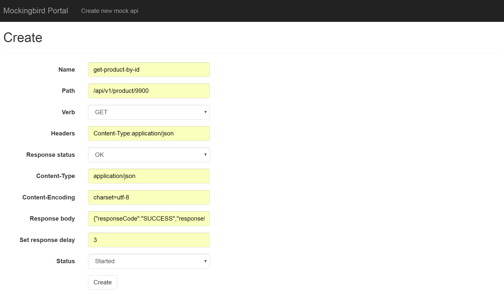
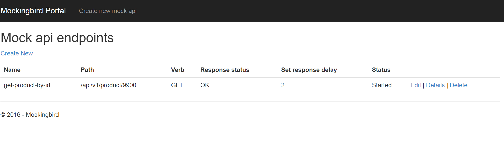

# Synopsis

Mockingbird is a simple ASP.Net web application to help developers setup mocking endpoints for development and testing of RESTful applications. After setting up this ASP.Net website on a server; developers can quickly cook up new RESTful api endpoints. These are useful especially in times of maintainances activities on downstream applications.

# Usage example

## Register Interception handler in WebApiConfig ##

Handler **MockRequestsInterceptor** does the interception for every requests that comes into this application with the exception for portal. Portal requests are routed to MVC controller which to display UI for adding new end.

```csharp
	// Web API configuration and services
    config.MessageHandlers.Add(new MockRequestsInterceptor());
```

## Interception handler ##

**Getting** endpoints from datasbase those are started (Active) and request payload matches that of mocked uri and VERB in database

```csharp
    var mockEndpointApiData = _db.MockApiHttpDatas.FirstOrDefault(x => x.ApiStatus == ApiStatus.Started
        && x.Verb.ToString() == incomingRequestData.RequestMethod.ToString()
        && x.Path == incomingRequestData.RequestUriPathAndQuery);
```


## Create new api endpoint and consume ##



## Mock api endpoints ##



# Motivation

Working in a Multi-tent architectures i have found myself blocked from completing development tasks by unavailable downstream api endpoints due maintenance or other issues in production and develop environments. Not able to do a complete round of integration testing because of **blockers** promted me to cook up this simple web application. I found mocking useful especially in companies with Hybrid SaaS infrastructures where applications are spread over in Cloud and OnPremises. By mocking OnPremise application endpoints, i was able to **bridge** broken connectivity to enable complete testing in development environments. I was also blindsided by frequent api changes on dependency development servers. It is quick to mock up a endpoint and continue with the rest of the development while for the responsible team to comes up with fix for broken endpoint. Saved me tons of time in those ways.

# Installation

You can download this asp.net web application and publish it to a web server as it is.

# License

GENERAL PUBLIC LICENSE